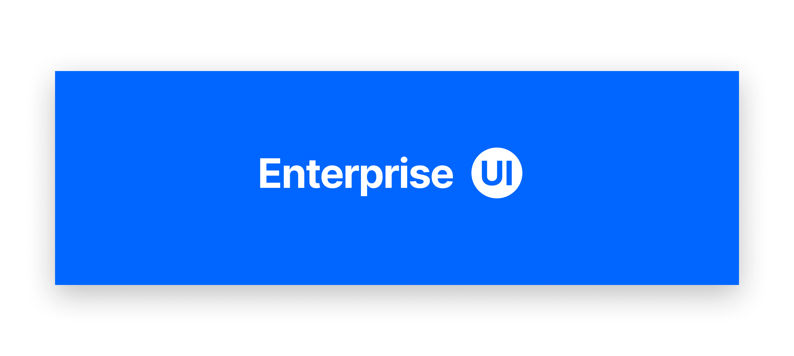

# React Native Enterprise UI Showcase App

The React Native Enterprise UI Showcase App is a cutting-edge mobile application project aimed at creating a visually stunning and user-friendly user interface (UI) for enterprise-level applications.

## Table of Contents

- [Introduction](#introduction)
- [Features](#features)
- [Requirements](#requirements)
- [Installation](#installation)
- [Usage](#usage)
- [Contributing](#contributing)
- [License](#license)

## Introduction

The React Native Enterprise UI Showcase App is a showcase application built with React Native that demonstrates modern UI design principles and patterns for enterprise-level mobile applications. This project serves as a reference implementation for developers looking to build visually appealing and user-friendly UIs for their own enterprise applications.

## Features

- **Visually Stunning UI**: The app features a modern and visually appealing user interface that incorporates the latest design trends and principles.
- **Responsive Layout**: The UI adapts to different screen sizes and orientations, providing a consistent user experience across various devices.
- **Interactive Components**: The app includes a wide range of interactive components such as buttons, forms, lists, and navigation menus.
- **Theme Customization**: The UI's color scheme and typography can be easily customized to match the branding of different enterprise applications.
- **Accessibility**: The app follows accessibility guidelines to ensure that users with disabilities can navigate and interact with the UI effectively.
- **Localization**: The UI supports multiple languages, making it accessible to a global audience.

## Requirements

Before installing the React Native Enterprise UI Showcase App, make sure you have the following prerequisites:

- Node.js (version 12 or above)
- npm (version 6 or above) or Yarn (version 1 or above)
- React Native CLI (version 0.63 or above)
- Xcode (for iOS development) or Android Studio (for Android development)

## Installation

Follow these steps to install and set up the React Native Enterprise UI Showcase App:

1. Clone the repository:

```bash
git clone https://github.com/your-username/react-native-enterprise-ui-showcase-app.git
```

2. Navigate to the project directory:

```
cd react-native-enterprise-ui-showcase-app
```

3. Install the dependencies using npm:

```
npm install or yarn install
```

3. Install the dependencies using npm:

```
npm install or yarn install
```

## Contributing

Contributions to the React Native Enterprise UI Showcase App are welcome! If you have any suggestions, bug reports, or feature requests, please open an issue on the GitHub repository.

1. Fork the repository.
2. Create a new branch:

## License

The React Native Enterprise UI Showcase App is licensed under the MIT License. Feel free to use, modify, and distribute the code as per the terms of the license.
